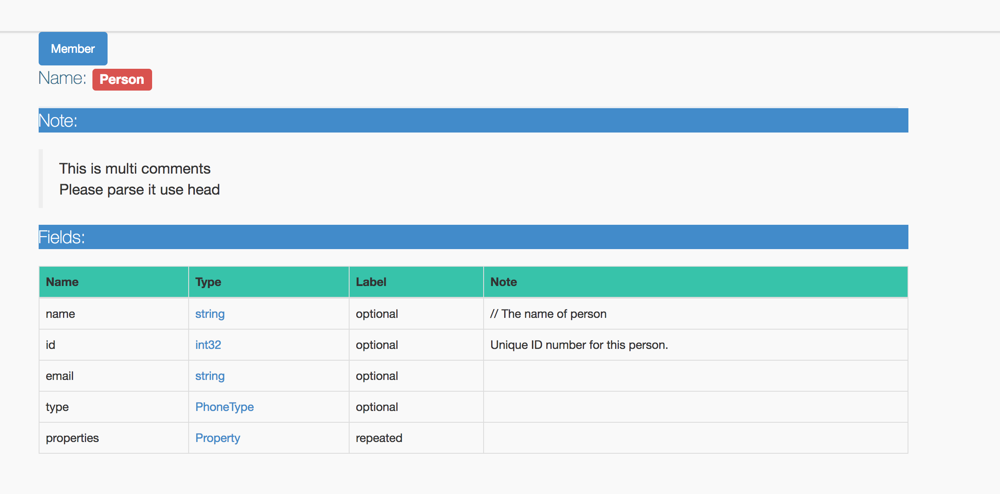
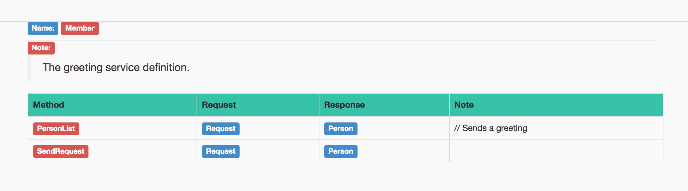

# Google protocol message parser

A tool used to parse Google protocol buffer message to JSON or html

--

## Install

```
go get github.com/wangming1993/pb2doc
```


## Usage

Build `pb` package under `./proto` folders and write HTML files to `./dist` folder

```
pb2doc build pb from ./protos
# change output folder
pb2doc build pb from ./protos --dist=html
```

## Features I needed

- [X] recursive parse message
- [X] support grpc service
- [ ] configurable doc type, maybe JSON,html or swagger
- [ ] annotation-based service description


## Overview





## Doc

[develop guidance](doc/guidance.md)
